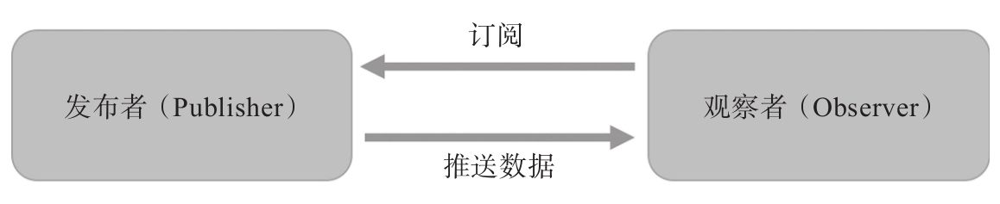

要理解RxJS，先要理解两个最重要的概念：Observable和Observer，可以说RxJS的运行就是Observable和Observer之间的互动游戏。

顾名思义，Observable就是“可以被观察的对象”即“可被观察者”​，而Observer就是“观察者”​，连接两者的桥梁就是Observable对象的函数subscribe。

RxJS中的数据流就是Observable对象，Observable实现了下面两种设计模式：

- 观察者模式（Observer Pattern）
- 迭代器模式（Iterator Pattern）

这两种模式在“四人帮”的《设计模式》一书中都有介绍。任何一种模式，指的都是解决某一个特定类型问题的套路和方法。现实世界的问题复杂多变，往往不是靠单独一种模式能够解决的，更需要的是多种模式的组合，RxJS的Observable就是观察者模式和迭代器模式的组合。

接下来，先分别介绍两种模式，然后看这两种模式结合在一起产生的强大力量。

### 观察者模式

观察者模式要解决的问题，就是在一个持续产生事件的系统中，如何分割功能，让不同模块只需要处理一部分逻辑，这种分而治之的思想是基本的系统设计概念，当然，​“分”很容易，关键是**如何“治”​**。

观察者模式对“治”这个问题提的解决方法是这样，**将逻辑分为发布者（Publisher）和观察者（Observer）​，其中发布者只管负责产生事件，它会通知所有注册挂上号的观察者，而不关心这些观察者如何处理这些事件，相对的，观察者可以被注册上某个发布者，只管接收到事件之后就处理，而不关心这些数据是如何产生的。**

==!!! 注意==

在很多介绍观察者模式的文献中，产生事件的叫做“主体”​（Subject）​，但是，很不巧在RxJS中Subject这个词有另外一个含义，在第10章中会介绍，在本书中用“发布者”​（Publisher）这个词称呼产生事件的元素。

在RxJS的世界中，Observable对象就是一个发布者，通过Observable对象的subscribe函数，可以把这个发布者和某个观察者（Observer）连接起来。



在下面的代码中，source$就是一个Observable对象，作为发布者，它产生的“事件”就是连续的三个整数：1、2、3：
```javascript
import {Observable} from 'rxjs/Observable';
import 'rxjs/add/observable/of';
const source$ = Observable.of(1, 2, 3);
source$.subscribe(console.log);
```

扮演观察者的是console.log函数，不管传入什么“事件”​，它只管把“事件”输出到console上，最终的运行结果，就是在console上输出三行，分别是1、2、3。

**观察者模式**带来的**好处**很明显，这个模式中的**两方都可以专心做一件事**，而且**可以任意组合**，也就是说，复杂的问题被分解成三个小问题：

- **如何产生事件**，这是**发布者**的责任，在RxJS中是 **Observable 对象**的工作。
- **如何响应事件**，这是**观察者**的责任，在RxJS中由 **subscribe** 的参数来决定。
- 什么样的**发布者关联**什么样的**观察者**，也就是何时调用subscribe。

### 迭代器模式

迭代者（Iterator，也称为“迭代器”​）指的是能够遍历一个数据集合的对象，因为数据集合的实现方式很多，可以是一个数组，也可以是一个树形结构，也可以是一个单向链表……迭代器的作用就是提供一个通用的接口，让使用者完全不用关心这个数据集合的具体实现方式。

迭代器另一个容易理解的名字叫游标（cursor）​，就像是一个移动的指针一样，从集合中一个元素移到另一个元素，完成对整个集合的遍历。

设计模式的实现方式很多，但是不管对应的函数如何命名，通常都应该包含这样几个函数：

- getCurrent，获取当前被游标所指向的元素。
- moveToNext，将游标移动到下一个元素，调用这个函数之后，getCurrent获得的元素就会不同。
- isDone，判断是否已经遍历完所有的元素。

使用这套函数来遍历一个集合的代码如下：

```javascript
const iterator = getIterator();
while (iterator.isDone()) {
  console.log(iterator.getCurrent());
  iterator. moveToNext ();
}
```

然而，在使用RxJS的过程中绝对看不到类似这样的代码，实际上，你都看不到上面所说的三个函数，因为，上面所说的是“拉”式的迭代器实现，而RxJS实现的是“推”式的迭代器实现。

==!!!提示==

在编程的世界中，所谓“拉”​（pull）或者“推”​（push）​，都是从数据消费者角度的描述，比如，在网页应用中，如果是网页主动通过AJAX请求从服务器获取数据，这是“拉”​，如果网页和服务器建立了websocket通道，然后，不需要网页主动请求，服务器都可以通过websocket通道推送数据到网页中，这是“推”​。在RxJS中，作为迭代器的使用者，并不需要主动去从Observable中“拉”数据，而是只要subscribe上Observable对象之后，自然就能够收到消息的推送，这就是观察者模式和迭代器两种模式结合的强大之处。


